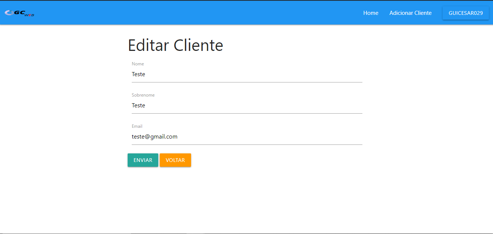

# projeto-final-senai

<h3> Used: </h3>

<ul>

  <li>PHP 7</li>

  <li>HTML</li>

  <li>MATERIALIZECSS</li>
  
  <li>Mysql</li>

</ul>

<h3>Screenshots:</h3>

<h3>Login</h3>

<h3>Lista de Clientes</h3>

<h3>Adicionar Cliente</h3>

<h3>Editar Cliente</h3>

<h3>Deletar Cliente</h3>

